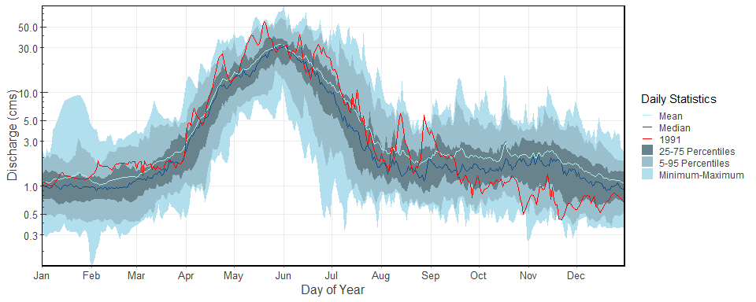
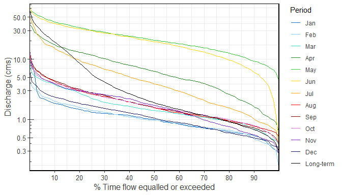
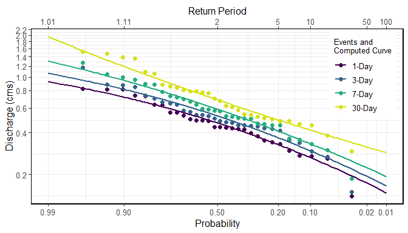

<!-- README.md is generated from README.Rmd. Please edit that file -->

# fasstr 

<!-- badges: start -->

<a id="devex-badge" rel="Stable" href="https://github.com/bcgov/repomountie/blob/enhancement/stateBadges/doc/lifecycle-badges.md"></a>
[](https://opensource.org/licenses/Apache-2.0)
[](https://travis-ci.org/bcgov/fasstr)

[](https://cran.r-project.org/package=fasstr)
[](https://CRAN.R-project.org/package=fasstr)
[](https://CRAN.R-project.org/web/checks/check_results_fasstr.html)
<!-- badges: end -->

</div>

The Flow Analysis Summary Statistics Tool for R (‘fasstr’) is a set of
[R](http://www.r-project.org) functions to tidy, summarize, analyze,
trend, and visualize streamflow data. This package summarizes continuous
daily mean streamflow data into various daily, monthly, annual, and
long-term statistics, completes annual trends and frequency analyses, in
both table and plot formats.

### Reference

[fasstr package 📦 home page and reference
guide](https://bcgov.github.io/fasstr/)

### Features

This package provides functions for streamflow data analysis, including:

  - data tidying (to prepare data for analyses; `add_*` and `fill_*`
    functions),
  - data screening (to identify data range, outliers and missing data;
    `screen_*` functions),
  - calculating summary statistics (long-term, annual, monthly and daily
    statistics; `calc_*`functions),
  - computing analyses (volume frequency analyses and annual trending;
    `compute_*` functions), and,
  - visualizing (data plotting the various statistics; `plot_*`
    functions).

Useful features of functions include:

  - the integration of the `tidyhydat` package to pull streamflow data
    from a Water Survey of Canada
    [HYDAT](https://www.canada.ca/en/environment-climate-change/services/water-overview/quantity/monitoring/survey/data-products-services/national-archive-hydat.html)
    database for analyses;
  - arguments for filtering of years and months in analyses and
    plotting;
  - choosing the start month of your water year;
  - selecting for rolling day averages (e.g. 7-day rolling average);
    and,
  - choosing how missing dates are handled, amongst others.

This package is maintained by the [Water Protection and Sustainability
Branch of the British Columbia Ministry of Environment and Climate
Change
Strategy](https://www2.gov.bc.ca/gov/content/environment/air-land-water/water).

### Installation

You can install `fasstr` directly from
[CRAN](https://cran.r-project.org/package=fasstr):

``` r
install.packages("fasstr")
```

To install the development version from
[GitHub](https://github.com/bcgov/fasstr), use the
[`remotes`](https://cran.r-project.org/package=remotes) package then the
`fasstr` package:

``` r
if(!requireNamespace("remotes")) install.packages("remotes")
remotes::install_github("bcgov/fasstr")
```

To use the `station_number` argument and pull data directly from a
[Water Survey of Canada HYDAT
database](https://www.canada.ca/en/environment-climate-change/services/water-overview/quantity/monitoring/survey/data-products-services/national-archive-hydat.html)
into `fasstr` functions, download a HYDAT file using the following code:

``` r
tidyhydat::download_hydat()
```

### Using fasstr

There are several vignettes and a cheatsheet to provide more information
on the usage of `fasstr` functions and how to customize various argument
options.

  - [Getting
    Started](https://bcgov.github.io/fasstr/articles/fasstr.html)
  - [Users
    Guide](https://bcgov.github.io/fasstr/articles/fasstr_users_guide.html)
  - [Computing an Annual Trends
    Analysis](https://bcgov.github.io/fasstr/articles/fasstr_trending_analysis.html)
  - [Computing a Volume frequency
    Analysis](https://bcgov.github.io/fasstr/articles/fasstr_frequency_analysis.html)
  - [Computing a Full fasstr
    Analysis](https://bcgov.github.io/fasstr/articles/fasstr_full_analysis.html)
  - [Internal fasstr
    Workflows](https://bcgov.github.io/fasstr/articles/fasstr_under_the_hood.html)

#### Cheatsheet

<a href="https://github.com/bcgov/fasstr/raw/master/fasstr_cheatsheet.pdf"></a>

#### Data Input

All functions in `fasstr` require a daily mean streamflow data set from
one or more hydrometric stations. Long-term and continuous data sets are
preferred for most analyses, but seasonal and partial data can be used.
Other daily time series data, like temperature, precipitation or water
levels, may also be used, but with certain caution as some
calculations/conversions are based on units of streamflow (cubic metres
per second). Data is provided to each function using the either the
`data` argument as a data frame of flow values, or the `station_number`
argument as a list of Water Survey of Canada HYDAT station numbers.

When using the `data` option, a data frame of daily data containing
columns of dates (YYYY-MM-DD in date format), values (mean daily
discharge in cubic metres per second in numeric format), and,
optionally, grouping identifiers (character string of station names or
numbers) is called. By default the functions will look for columns
identified as ‘Date’, ‘Value’, and ‘STATION\_NUMBER’, respectively, to
be compatible with the ‘tidyhydat’ defaults, but columns of different
names can be identified using the `dates`, `values`, `groups` column
arguments (ex. `values = Yield_mm`). The following is an example of an
appropriate data frame (STATION\_NUMBER not required):

    #>   STATION_NUMBER       Date Value
    #> 1        08NM116 1949-04-01  1.13
    #> 2        08NM116 1949-04-02  1.53
    #> 3        08NM116 1949-04-03  2.07
    #> 4        08NM116 1949-04-04  2.07
    #> 5        08NM116 1949-04-05  2.21
    #> 6        08NM116 1949-04-06  2.21

Alternatively, you can directly pull a flow data set directly from a
HYDAT database (if installed) by providing a list of station numbers in
the `station_number` argument (ex. `station_number = "08NM116"` or
`station_number = c("08NM116", "08NM242")`) while leaving the data
arguments blank. A data frame of daily streamflow data for all stations
listed will be extracted using `tidyhydat` and then `fasstr`
calculations will produce results of the functions.

This package allows for multiple stations (or other groupings) to be
analyzed in many of the functions provided identifiers are provided
using the `groups` column argument (defaults to STATION\_NUMBER). If
grouping column doesn’t exist or is improperly named, then all values
listed in the `values` column will be summarized.

#### Function Types

##### Tidying

These functions, start with either `add_*` or `fill_*`, add columns and
rows, respectively, to streamflow data frames to help set up your data
for further analysis. Examples include adding rolling means, adding date
variables (WaterYear, Month, DayofYear, etc.), adding basin areas,
adding columns of volumetric discharge and water yields, and filling
dates with missing flow values with `NA`.

##### Analysis

The analysis functions summarize your discharge values into various
statistics. `screen_*` functions summarize annual data for outliers and
missing dates. `calc_*` functions calculate daily, monthly, annual, and
long-term statistics (e.g. mean, median, maximum, minimum, percentiles,
amongst others) of daily, rolling days, and cumulative flow data.
`compute_*` functions also analyze data but produce more in-depth
analyses, like frequency and trending analysis, and may produce multiple
plots and tables as a result. All tables are in tibble data frame
formats. Can use `write_flow_data()` or `write_results()` to customize
saving tibbles to a local drive.

##### Visualization

The visualization functions, which begin with `plot_*`, plot the various
summary statistics and analyses as a way to visualize the data. While
most plotting function statistics can be customized, some come pre-set
with statistics that cannot be changed. Plots can be further modified by
the user using the `ggplot2` package and its functions. All plots
functions produce lists of plots (even if just one produced). Can use
`write_plots()` to customize saving the lists of plots to a local drive
(within folders or PDF documents).

#### Function Options

##### Daily Rolling Means

If certain n-day rolling mean statistics are desired to be analyzed
(e.g. 3- or 7-day rolling means) some functions provide the ability to
select for that as function arguments (e.g. `rolling_days = 7` and
`rolling_align = "right"`). The rolling day align is the placement of
the date amongst the n-day means, where “right” averages the day-of and
previous n-1 days, “centre” date is in the middle of the averages, and
“left” averages the day-of and the following n-1 days. For your own
analyses you can add rolling means to your data set using the
`add_rolling_means()` function.

##### Year and Month Filtering

To customize your analyses for specific time periods, you can designate
the start and end years of your analysis using the `start_year` and
`end_year` arguments and remove any unwanted years (for partial data
sets for example) by listing them in the `excluded_years` argument
(e.g. `excluded_years = c(1990, 1992:1994)`). Alternatively, some
functions have an argument called `complete_years` that summarizes data
from just those years which have complete flow records. Some functions
will also allow you to select the months of a year to analyze, using the
`months` argument, as opposed to all months (if you want just summer
low-flows, for example). Leaving these arguments blank will result in
the summary/analysis of all years and months of the provided data set.

To group analyses by water, or hydrologic, years instead of calendar
years, if desired, you can set `water_year_start` within most functions
to another month than 1 (for January). A water year can be defined as a
12-month period that comprises a complete hydrologic cycle (wet seasons
can typically cross calendar year), typically starting with the month
with minimum flows (the start of a new water recharge cycle). If another
start month is desired, you can choose it using the `water_year_start`
argument (numeric month). The water year identifier is designated by the
year it ends in (e.g. a water year from Oct 1, 1999 to Sep 30, 2000 is
designated as 2000). Start, end and excluded years will be based on the
specified water year.

For your own analyses, you can add date variables to your data set using
the `add_date_variables()` or `add_seasons()` functions.

##### Drainage Basin Area

Yield runoff statistics (in millimetres) calculated in the some of the
functions require an upstream drainage basin area (in sq. km) using the
`basin_area` argument. If no basin areas are supplied, all yield results
will be `NA`. To apply a basin area (10 sqkm for example) to all daily
observations, set the argument as `basin_area = 10`. If there are
multiple stations or groups to apply multiple basin areas (using the
`groups` argument), set them individually using this option: `basin_area
= c("08NM116" = 795, "08NM242" = 22)`. If a STATION\_NUMBER column
exists with HYDAT station numbers, the function will automatically use
the basin areas provided in HYDAT, if available, so `basin_area` is not
required. For your own analyses, you can add basin areas to your data
set using the `add_basin_area()` function.

##### Handling Missing Dates

With the use of the `ignore_missing` argument in most functions, you can
decide how to handle dates with missing flow values in calculations.
When you set `ignore_missing = TRUE` a statistic will be calculated for
a given year, all years, or month regardless of if there are missing
flow values. When `ignore_missing = FALSE` the returned value for the
period will be `NA` if there are missing values.

Some functions have an argument called `complete_years` which can be
used, when set to `TRUE`, to filter out years that have partial data
sets (for seasonal or other reasons) and only years with full data are
used to calculate statistics.

### Examples

#### Summary statistics example: long-term statistics

To determine the long-term summary statistics of daily data for each
month (mean, median, maximum, minimum, and some percentiles) you can use
the `calc_longterm_daily_stats()` function. If the ‘Mission Creek near
East Kelowna’ hydrometric station is of interest you can list the
station number in the `station_number` argument to obtain the data (if
`tidyhydat` and HYDAT are installed). Statistics over several months can
also be calculated, if of interest. See the summer statistics (from July
to Septmber) in this example.

``` r
calc_longterm_daily_stats(station_number = "08NM116", 
                          start_year = 1981, 
                          end_year = 2010,
                          custom_months = 7:9, 
                          custom_months_label = "Summer")
#> # A tibble: 14 x 8
#>    STATION_NUMBER Month      Mean Median Maximum Minimum   P10   P90
#>    <chr>          <fct>     <dbl>  <dbl>   <dbl>   <dbl> <dbl> <dbl>
#>  1 08NM116        Jan        1.22  1        9.5    0.160 0.540  1.85
#>  2 08NM116        Feb        1.16  0.970    4.41   0.140 0.474  1.99
#>  3 08NM116        Mar        1.85  1.40     9.86   0.380 0.705  3.80
#>  4 08NM116        Apr        8.32  6.26    37.9    0.505 1.63  17.5 
#>  5 08NM116        May       23.6  20.8     74.4    3.83  9.33  41.2 
#>  6 08NM116        Jun       21.5  19.5     84.5    0.450 6.10  38.9 
#>  7 08NM116        Jul        6.48  3.90    54.5    0.332 1.02  15   
#>  8 08NM116        Aug        2.13  1.57    13.3    0.427 0.775  4.29
#>  9 08NM116        Sep        2.19  1.58    14.6    0.364 0.735  4.35
#> 10 08NM116        Oct        2.10  1.60    15.2    0.267 0.794  3.98
#> 11 08NM116        Nov        2.04  1.73    11.7    0.260 0.560  3.90
#> 12 08NM116        Dec        1.30  1.05     7.30   0.342 0.5    2.33
#> 13 08NM116        Long-term  6.17  1.89    84.5    0.140 0.680 19.3 
#> 14 08NM116        Summer     3.61  1.98    54.5    0.332 0.799  7.64
```

#### Plotting example: daily summary statistics

To visualize the daily streamflow patterns on an annual basis, the
`plot_daily_stats()` function will plot out various summary statistics
for each day of the year. Data can also be filtered for certain years of
interest (a 1981-2010 normals period for this example) using the
`start_year` and `end_year` arguments. We can also compare individual
years against the statistics using `add_year` argument like below.

``` r
plot_daily_stats(station_number = "08NM116",
                 start_year = 1981,
                 end_year = 2010,
                 log_discharge = TRUE,
                 add_year = 1991)
#> $Daily_Statistics
```

<!-- -->

#### Plotting example: flow duration curves

Flow duration curves can be produced using the `plot_flow_duration()`
function.

``` r
plot_flow_duration(station_number = "08NM116",
                   start_year = 1981,
                   end_year = 2010)
#> $Flow_Duration
```

<!-- -->

#### Analysis example: low-flow frequency analysis

This package also provides a function, `compute_annual_frequencies()`,
to complete a volume frequency analysis by fitting annual minimums or
maximums to Log-Pearson Type III or Weibull probability distributions.
See the volume frequency analyses documentation for more information.
For this example, the 7-day low-flow quantiles are calculated for the
Mission Creek hydrometric station using the Log-Pearson Type III
distribution and method of moments fitting method (both default). With
this, several low-flow indicators can be determined (i.e. 7Q5, 7Q10).

``` r
freq_results <- compute_annual_frequencies(station_number = "08NM116",
                                           start_year = 1981,
                                           end_year = 2010,
                                           roll_days = 7,
                                           fit_distr = "PIII",
                                           fit_distr_method = "MOM")
freq_results$Freq_Fitted_Quantiles
#> # A tibble: 11 x 4
#>    Distribution Probability `Return Period` `7-Day`
#>    <chr>              <dbl>           <dbl>   <dbl>
#>  1 PIII               0.01           100      0.193
#>  2 PIII               0.05            20      0.277
#>  3 PIII               0.1             10      0.332
#>  4 PIII               0.2              5      0.408
#>  5 PIII               0.5              2      0.588
#>  6 PIII               0.8              1.25   0.812
#>  7 PIII               0.9              1.11   0.946
#>  8 PIII               0.95             1.05   1.07 
#>  9 PIII               0.975            1.03   1.17 
#> 10 PIII               0.98             1.02   1.21 
#> 11 PIII               0.99             1.01   1.31
```

The probability of observed extreme events can also be plotted (using
selected plotting position) along with the computed quantiles curve for
comparison.

``` r
freq_results <- compute_annual_frequencies(station_number = "08NM116",
                                           start_year = 1981,
                                           end_year = 2010,
                                           roll_days = c(1,3,7,30))
freq_results$Freq_Plot
```

<!-- -->

### Project Status

This package is set for delivery. This package is maintained by the
Water Protection and Sustainability Branch of the [British Columbia
Ministry of Environment and Climate Change
Strategy](https://www2.gov.bc.ca/gov/content/environment/air-land-water/water).

### Getting Help or Reporting an Issue

To report bugs/issues/feature requests, please file an
[issue](https://github.com/bcgov/fasstr/issues/).

### How to Contribute

If you would like to contribute to the package, please see our
[CONTRIBUTING](CONTRIBUTING.md) guidelines.

Please note that this project is released with a [Contributor Code of
Conduct](CODE_OF_CONDUCT.md). By participating in this project you agree
to abide by its terms.

### License

    Copyright 2019 Province of British Columbia
    
    Licensed under the Apache License, Version 2.0 (the "License");
    you may not use this file except in compliance with the License.
    You may obtain a copy of the License at 
    
       http://www.apache.org/licenses/LICENSE-2.0
    
    Unless required by applicable law or agreed to in writing, software
    distributed under the License is distributed on an "AS IS" BASIS,
    WITHOUT WARRANTIES OR CONDITIONS OF ANY KIND, either express or implied.
    See the License for the specific language governing permissions and
    limitations under the License.
